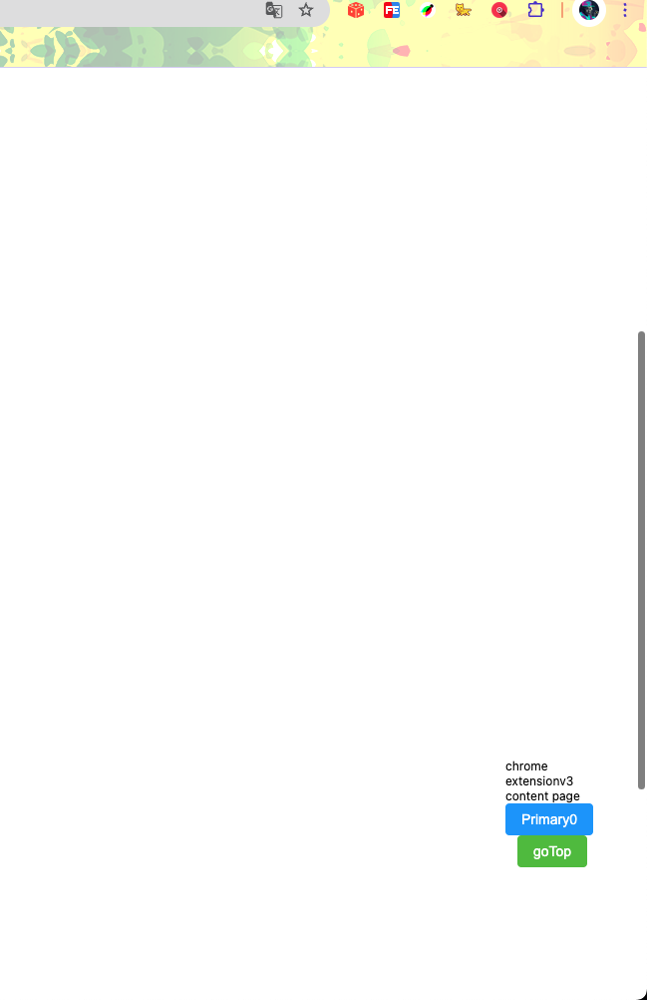

# Vue 3 + TypeScript + Vite + Pinia + Element-Plus + TailwindCSS 实现chrome插件
## 插件功能 页面滚动到一定距离时，显示一个悬浮框，悬浮框中有一个按钮，点击按钮后，页面滚动到顶部

1. 安装依赖 pnpm install
2. 打包项目 pnpm run build
3. 在chrome浏览器中加载扩展
   1. 打开chrome浏览器，访问chrome://extensions/
   2. 打开开发者模式
   3. 点击“加载已解压的扩展程序”，选择dist目录
   4. 点击“完成”
   5. 在浏览器中访问http://127.0.0.1:5500/*（vscode live server）
4. 效果展示
    